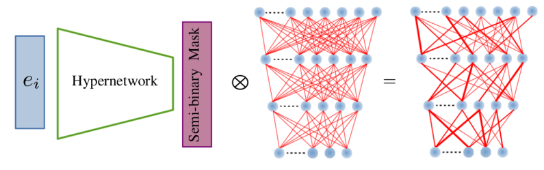

# HyperMask: Adaptive Hypernetwork-based Masks for Continual Learning

Generate a semi-binary mask for a target network using a hypernetwork.

Use <code>environment.yml</code> file to create a conda environment with necessary libraries. One of the most essential packages is [hypnettorch](https://github.com/chrhenning/hypnettorch) which should easy create hypernetworks in [PyTorch](https://pytorch.org/).

## DATASETS

The implemented experiments uses four publicly available datasets for continual learning tasks: Permuted MNIST, Split MNIST, Split CIFAR-100 and Tiny ImageNet. The datasets may be downloaded when the algorithm runs.

## USAGE

The description of HyperMask is included in the [paper](https://arxiv.org/abs/2310.00113). To perform experiments with the use of the best hyperparameters found and reproduce the results from the publication for five different seed values, one should run <code>main.py</code> file with the variable <code>create_grid_search</code> set to <code>False</code> and the variable <code>dataset</code> set to <code>PermutedMNIST</code>, <code>SplitMNIST</code>, <code>CIFAR100</code> or <code>TinyImageNet</code>. In the third and fourth cases, as a target network <code>ResNet-20</code> or <code>ZenkeNet</code> can be selected. To train ResNets, it is necessary to set <code>part = 0</code>, while to prepare ZenkeNets, one has to set <code>part = 1</code>. In the remaining cases, the variable <code>part</code> is insignificant.

Also, to prepare experiments with <code>CIFAR100</code> according to the FeCAM scenario, one should set the variable <code>dataset</code> in <code>main.py</code> to <code>CIFAR100_FeCAM_setup</code> with <code>part = 6</code> to run training with a ResNet model or <code>part = 7</code> to train a ZenkeNet model.

One can also easily perform hyperparameter optimization using a grid search technique. For this purpose, one should set the variable <code>create_grid_search</code> to <code>True</code> in <code>main.py</code> file and modify lists with hyperparameters for the selected dataset in <code>datasets.py</code> file.
